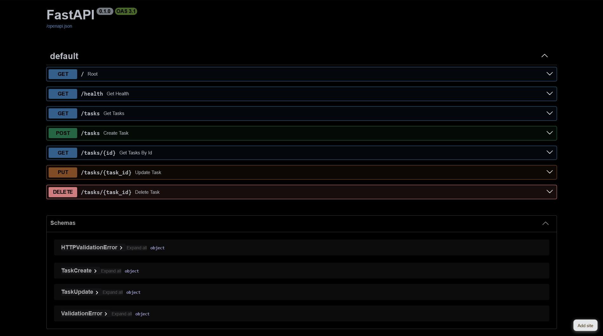

# Task API

A simple CRUD (Create, Read, Update, Delete) REST API built with FastAPI, as part of the FlyRank BE-01 backend engineering stage.

## What is this?

A minimal in-memory Task API demonstrating core backend concepts: routing, request validation, status codes, and auto-generated API documentation via Swagger UI.

## Install & Run

```bash
pip install fastapi uvicorn
uvicorn main:app --reload
```

The server starts at `http://localhost:8000`. Interactive docs are available at `http://localhost:8000/docs`.

## Endpoints

| Method | Path          | Description       | Success | Error    |
| ------ | ------------- | ----------------- | ------- | -------- |
| GET    | `/`           | API info          | 200     | —        |
| GET    | `/health`     | Health check      | 200     | —        |
| GET    | `/tasks`      | List all tasks    | 200     | —        |
| GET    | `/tasks/{id}` | Get a single task | 200     | 404      |
| POST   | `/tasks`      | Create a new task | 201     | 400      |
| PUT    | `/tasks/{id}` | Update a task     | 200     | 400, 404 |
| DELETE | `/tasks/{id}` | Delete a task     | 204     | 404      |

## Example

```bash
$ curl -i -X POST http://localhost:8000/tasks -H "Content-Type: application/json" -d '{"title":"Buy milk"}'
HTTP/1.1 201 Created
date: Sun, 16 Aug 2026 21:14:38 GMT
server: uvicorn
content-length: 40
content-type: application/json

{"id":4,"title":"Buy milk","done":false}
```

## Swagger UI


