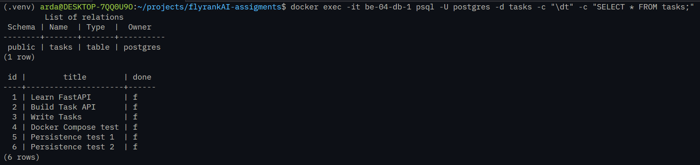

# BE-04: Task API with Postgres + Docker Compose

Simple Task API built with FastAPI + SQLModel + PostgreSQL.  
Everything runs with a single command.

## Run

```bash
cp .env.example .env
docker compose up --build
```

API will be available at: http://localhost:8000

## Environment Variables

Copy `.env.example` to `.env`.

The important variable is:

```env
DATABASE_URL=postgresql+psycopg://postgres:dev@db:5432/tasks
```

> Note: Inside Docker the host must be `db` (the service name), not `localhost`.

## Endpoints

| Method | Endpoint      | Description       | Status Codes  |
| ------ | ------------- | ----------------- | ------------- |
| GET    | `/`           | API info          | 200           |
| GET    | `/health`     | Health check      | 200           |
| GET    | `/tasks`      | List all tasks    | 200           |
| GET    | `/tasks/{id}` | Get a single task | 200, 404      |
| POST   | `/tasks`      | Create a new task | 201, 400      |
| PUT    | `/tasks/{id}` | Update a task     | 200, 400, 404 |
| DELETE | `/tasks/{id}` | Delete a task     | 204, 404      |

## Example

```bash
curl -i -X POST http://localhost:8000/tasks \
  -H "Content-Type: application/json" \
  -d '{"title": "My first task"}'
```

## Database

After starting the stack you can inspect the data:

```bash
docker exec -it be-04-db-1 psql -U postgres -d tasks -c "\dt"
docker exec -it be-04-db-1 psql -U postgres -d tasks -c "SELECT * FROM tasks;"
```

## Notes

- Data is persisted with a Docker volume (`taskdata`)
- The app creates the `tasks` table and seeds 3 example tasks on first run
- Restarting the stack keeps your data

## Database


